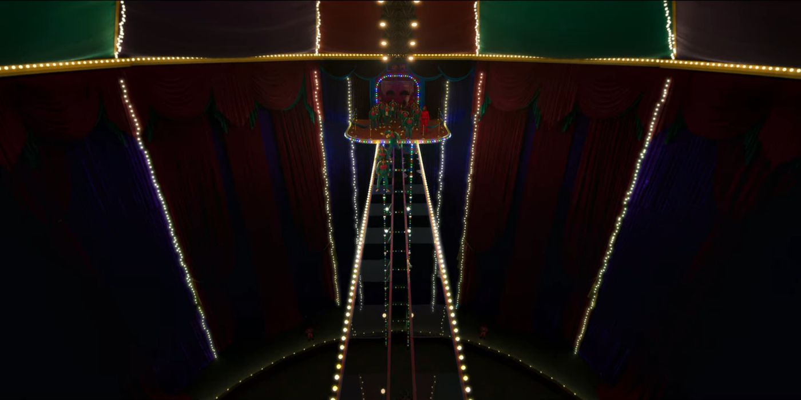
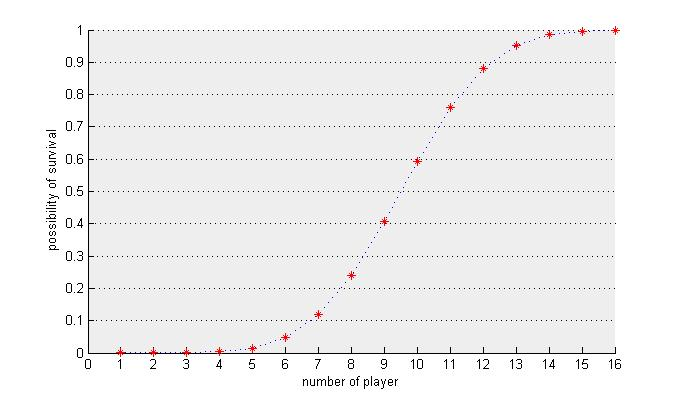

# Squid game TV series bridge level survival possibility
 This matlab function calculates survival possibility of each player in Bridge level in Squid Game TV series 
 
 <p float="middle">
    
</p>
 
 ## deadpossibility
 ```deadpossibility(n,t)``` function calculates possibility of dying of nth player in exactly t-th step of the bridge.
 Since this probability for nth person is depended on the performance and dead probabilities for (n-1)th person this function is a recursive function.
 For the first one of course dead possibility in the t-th steps is equal to (0.5)^(t) since with the possibility of (0.5)^(t-1) the player survives t-1 steps and with  the possibility of (0.5) falls down in the t-th step.
 
 ## livepossibility
  ```livepossibility(n,t)``` function calculates possibility of surviving of nth player after (t) steps.
 By calculating the sum of dead possibilities in all steps (from 1 to t) and subtracting it from 1, we can calculate the survival possibility.
 
 ## Results:
 In the below diagram the survival possibility of 16 players in a 18-steps bridge is demonstrated.
 
 <p float="middle">
    
</p>

